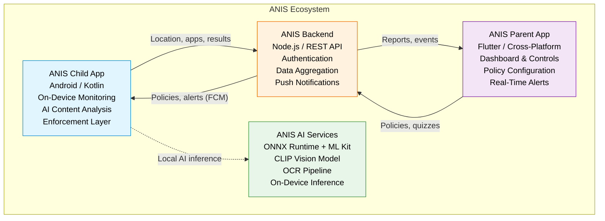
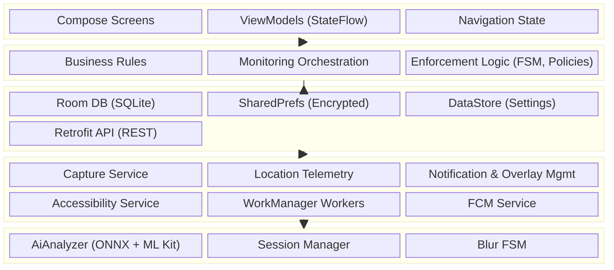
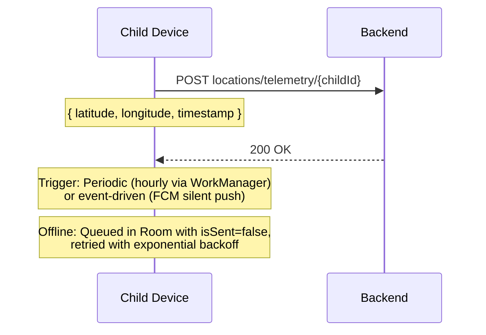
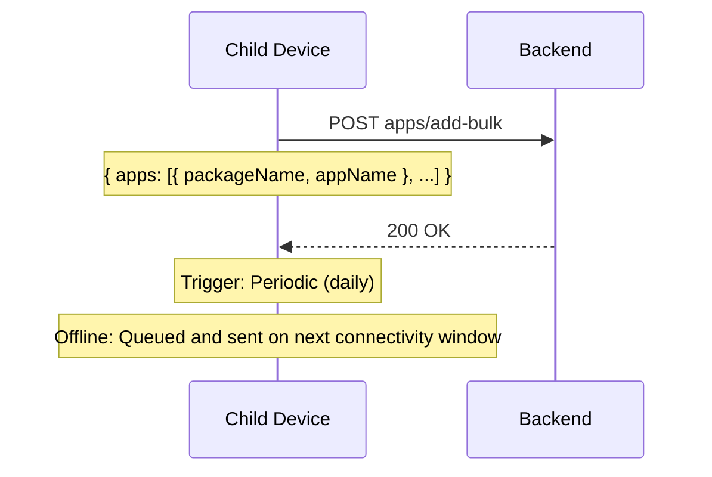
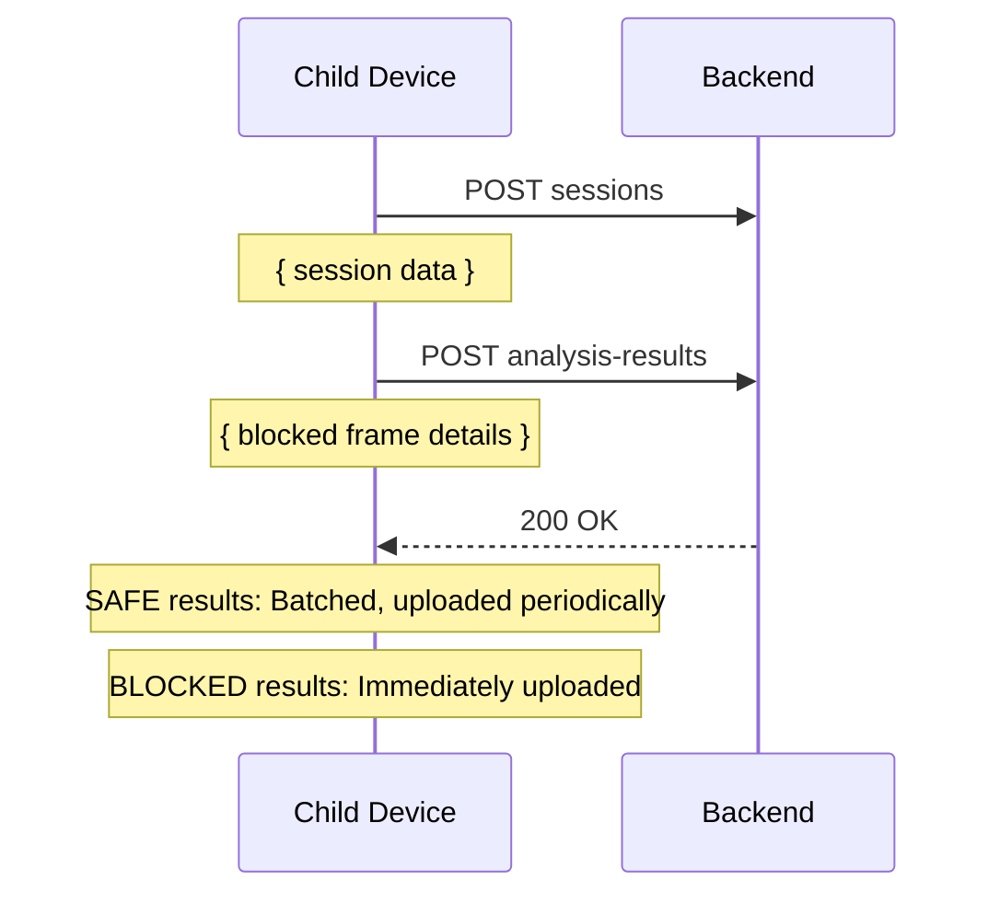
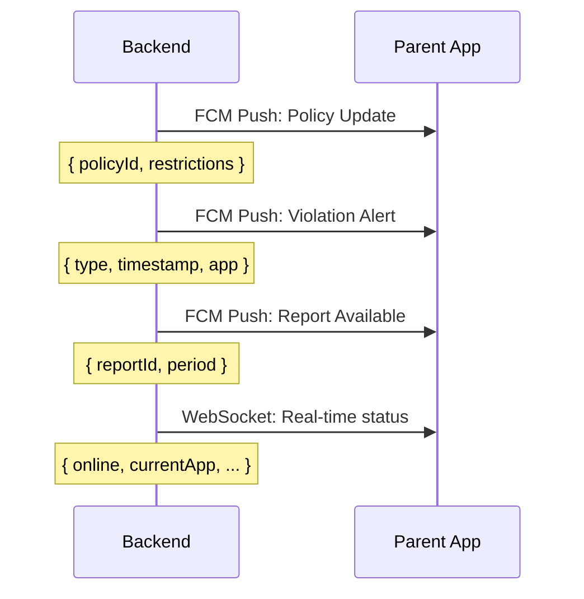
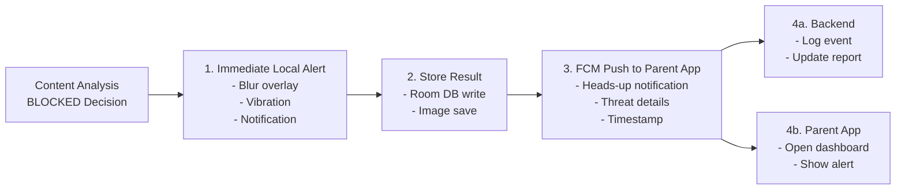
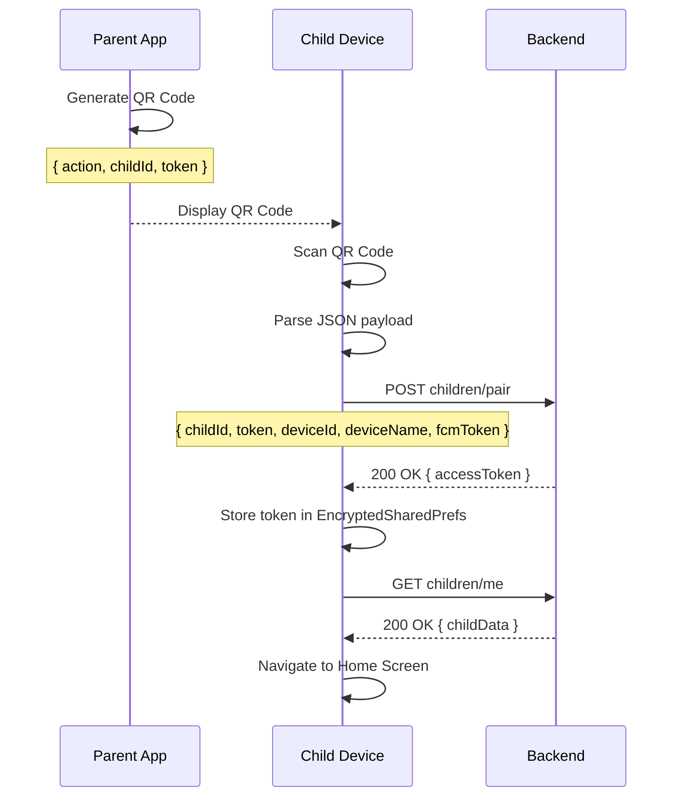

# System Architecture and Design

## 1. Introduction

### 1.1 Overview

The ANIS (Advanced Network Intelligence & Safety) Child Application is the device-side enforcement component of the ANIS parental control ecosystem. It is installed on the child's Android device and serves as the protection and monitoring layer of the platform. The application operates in conjunction with three other major components:

- **ANIS Parent Application** (Flutter): A cross-platform mobile application that provides parents with a dashboard for monitoring their children's digital activity, setting policies, and receiving alerts.
- **ANIS Backend Services** (Node.js): A central coordination service that mediates communication between parent and child devices, stores policies and usage data, and manages device pairing.
- **ANIS AI Services**: On-device AI inference engines that perform real-time content moderation using ONNX Runtime and Google ML Kit, operating entirely on the child device to preserve privacy.

*Figure 1.1: ANIS ecosystem component interaction diagram.*

The child application functions as the enforcement and protection layer. It captures screen content at configurable intervals, analyzes it through a multi-stage AI pipeline, applies protective overlays when inappropriate content is detected, tracks device usage and location, and synchronizes data with the backend for parent visibility. All content analysis is performed on-device, ensuring that sensitive data never leaves the child's device.

### 1.2 Purpose

The ANIS Child Application is designed to fulfill five primary objectives:

- **Protect children from harmful digital content**: Real-time screen monitoring using on-device AI classifies content across threat categories (adult, violence, profanity, drugs, weapons, hate, gambling) and applies protective measures when violations are detected.
- **Enforce parental control policies**: Restrictions configured by parents through the parent application are synchronized to the child device and enforced locally, even when the device is offline.
- **Promote healthy digital habits**: Screen time limits and scheduled access periods encourage balanced device usage.
- **Encourage educational engagement**: A reward system motivates children to engage with educational content and earn additional usage time through positive behavior.
- **Balance child safety with privacy**: Raw screen content (captured images, extracted text) remains on-device and is never transmitted. Analysis results (decisions, threat scores, timestamps) are sent to the backend to provide parents with visibility into their child's digital behavior while preserving privacy.

### 1.3 Scope

The child application is responsible for all monitoring, analysis, and enforcement functions that execute on the child's device. These responsibilities are divided into local and backend-dependent operations:

**Local Operations (performed entirely on-device):**

- Screen content capture via MediaProjection API
- OCR text detection via Google ML Kit
- ONNX Runtime model inference for image classification
- Blur overlay display for blocked content
- Accessibility Service-based usage tracking
- PIN validation for offline Settings access
- Background service lifecycle management
- Offline policy caching and local enforcement
- Raw image and text data storage (never transmitted)

**Backend-Dependent Operations (require network connectivity):**

- Device pairing via QR code
- Location telemetry upload
- Installed applications reporting
- Session and analysis results transmission (decisions, threat scores, timestamps, device stats)
- FCM token registration for push notifications
- Child profile synchronization
- Reward state synchronization
- Policy updates from parent configuration

### 1.4 Non-Functional Requirements

| ID     | Requirement                               | Target                          |
| ------ | ----------------------------------------- | ------------------------------- |
| NFR-01 | AI analysis latency per frame             | < 1000 ms                       |
| NFR-02 | Memory footprint (sustained)              | < 250 MB PSS                    |
| NFR-03 | Battery drain rate                        | < 20% per hour                  |
| NFR-04 | Offline operation capability              | 24+ hours cached policies       |
| NFR-05 | Monitoring service uptime                 | 99.9% (excluding device reboot) |
| NFR-06 | Secure token storage                      | AES-256-GCM encrypted           |
| NFR-07 | API communication                         | TLS 1.3                         |
| NFR-08 | Banned word detection accuracy            | > 95%                           |
| NFR-09 | Threat classification false positive rate | < 5%                            |
| NFR-10 | Data retention                            | Auto-cleanup after 7 days       |

## 2. Technology Selection and Justification

### 2.1 Development Technology Stack

The ANIS Child Application is built on the Android platform using modern Kotlin-based development practices. The following table summarizes the technologies and libraries selected for each application layer:

| Layer                    | Technology                                       | Purpose                                                                          |
| ------------------------ | ------------------------------------------------ | -------------------------------------------------------------------------------- |
| **Language**             | Kotlin 2.0.21                                    | Primary development language with null safety, coroutines, and sealed classes    |
| **UI Framework**         | Jetpack Compose + Material 3                     | Declarative UI with Material You theming and dynamic color support               |
| **Architecture**         | MVVM + Repository Pattern                        | Separation of concerns with lifecycle-aware components                           |
| **Dependency Injection** | Hilt 2.51.1                                      | Compile-time dependency injection with application, activity, and service scopes |
| **AI Inference**         | ONNX Runtime Android 1.25.0                      | On-device CLIP-based vision model inference with FP16 quantization               |
| **OCR**                  | Google ML Kit Text Recognition 16.0.0            | On-device text extraction from screen captures                                   |
| **Screen Capture**       | MediaProjection API + ImageReader                | System-level screen capture with VirtualDisplay                                  |
| **Background Work**      | WorkManager 2.9.1                                | Deferred and periodic background tasks with constraint-based scheduling          |
| **Local Database**       | Room 2.6.1                                       | Type-safe SQLite persistence with Flow-based reactive queries                    |
| **Preferences**          | EncryptedSharedPreferences 1.1.0                 | AES-256-GCM encrypted storage for authentication tokens                          |
| **Networking**           | Retrofit 2.9.0 + OkHttp 4.12.0                   | Type-safe HTTP client with interceptor-based authentication                      |
| **Serialization**        | Kotlinx.serialization 1.6.2                      | Compile-time JSON serialization for API communication                            |
| **Push Notifications**   | Firebase Cloud Messaging 33.12.0                 | Remote push notification delivery and silent data sync triggers                  |
| **QR Scanning**          | CameraX 1.4.0 + ML Kit Barcode 17.3.0            | Camera-based QR code scanning for device pairing                                 |
| **Location**             | Google Play Services Location 21.3.0             | Fused location provider for periodic GPS telemetry                               |
| **Export**               | FastExcel 0.18.1                                 | XLSX workbook generation for session data export                                 |
| **Build System**         | Gradle 8.13 + AGP 8.13.2 + Kotlin Compose plugin | Modern build configuration with version catalog                                  |
| **CI/CD**                | GitHub Actions                                   | Automated build, signing, and release publishing                                 |

**Platform Configuration:**

| Property               | Value                       |
| ---------------------- | --------------------------- |
| Application ID         | `com.anis.child`            |
| Minimum SDK            | API 24 (Android 7.0)        |
| Target SDK             | API 36 (Android 16)         |
| Compile SDK            | API 36                      |
| Kotlin JVM Target      | 11                          |
| Gradle Version Catalog | `gradle/libs.versions.toml` |

### 2.2 Why Native Android Instead of Flutter

The decision to implement the ANIS Child Application as a native Android application rather than a cross-platform Flutter alternative was informed by empirical performance data collected from a controlled experiment comparing both implementations of the ANIS AI content moderation pipeline. The experiment, documented in the ANIS research paper [1], tested both implementations under identical conditions (15.5-minute sessions, approximately 900 frames each, same ONNX model and ML Kit pipeline) and provided the following evidence.

#### Deep Android System Integration

ANIS requires direct interaction with Android system services that are inaccessible or restricted in cross-platform frameworks:

- **Accessibility Service**: Critical for monitoring app usage, detecting foreground app changes, and intercepting navigation for restriction enforcement. Requires direct Android Service registration and lifecycle management.
- **MediaProjection API**: Screen capture for content analysis requires MediaProjectionManager and VirtualDisplay, both platform-specific APIs that would require custom plugin development in Flutter.
- **UsageStatsManager**: Application usage tracking requires system-level permission and direct querying of system usage statistics.
- **KeyStore / EncryptedSharedPreferences**: Security-sensitive token storage relies on Android hardware-backed keystore, accessible only through Android-specific crypto APIs.
- **System Overlays**: The blur overlay for blocked content uses TYPE_APPLICATION_OVERLAY window type, requiring direct WindowManager interaction.

In a Flutter implementation, all of the above would require custom native plugins communicating through MethodChannel, introducing serialization overhead of approximately 114 microseconds per call compared to 0.5 microseconds for direct native invocations [2], a difference of over two orders of magnitude.

#### Performance Summary

A controlled experiment [1] compared both implementations under identical conditions (15.5-minute sessions, Google Pixel 6, ~900 frames each, same ONNX FP16 vision model and ML Kit OCR pipeline).

**CPU Utilization:**

| Metric | Native Android | Flutter |
|---|---|---|
| Average CPU Usage | 19.42% | 18.91% |
| Variance | Lower | Higher (Dart GC events) |

**Processing Latency (Per-Phase Breakdown):**

| Phase | Native Android | Flutter | Ratio |
|---|---|---|---|
| OCR (ML Kit) | 176.0 ms | 122.5 ms | 0.70x |
| Image Preprocessing | 97.0 ms | 109.0 ms | 1.12x |
| ONNX Inference | 372.0 ms | 532.5 ms | 1.43x |
| Total Analysis | 645.0 ms | 764.0 ms | 1.18x |

The 1.43x ONNX inference slowdown in Flutter is attributed to Dart FFI marshalling overhead. Flutter's OCR phase is faster (0.70x), likely due to a more efficient ML Kit integration path.

**Tail Latency:**

| Metric | Native Android | Flutter |
|---|---|---|
| Maximum frame latency | 1047 ms | 7829 ms |
| Frames exceeding 1000 ms | None | 12.8% |
| Frames exceeding 2000 ms | None | 0.3% (3 of 999) |
| 95th percentile | ~870 ms | 1169 ms |
| 99th percentile | ~950 ms | 1276 ms |

Flutter's worst outlier (7829 ms) was caused by an OCR pipeline stall coinciding with Dart garbage collection, a failure mode that does not affect the native Android runtime.

**Memory Consumption:**

| Metric | Native Android | Flutter | Ratio |
|---|---|---|---|
| Average PSS Memory | ~180 MB | 955.3 MB | ~5.3x |
| Peak PSS Memory | ~200 MB | 1,160 MB | ~5.8x |

Flutter memory ranges from 181.6 MB (idle) to 1.16 GB (under load), driven by its bundled rendering engine (Skia/Impeller), Dart VM overhead, and double-layer architecture.

**Battery Consumption:**

| Metric | Native Android | Flutter |
|---|---|---|
| Total Discharge (15.5 min) | 197 mAh | 192 mAh |
| App Power Contribution | 31.6 mAh | ~74 mAh (2.3x) |

While total battery drain is similar, the app-level contribution is 2.3x higher in Flutter.

**Network Data Transfer:**

| Metric | Native Android | Flutter |
|---|---|---|
| Data Transferred | Baseline | 5.8x higher |

#### Security and Stability

Native Android provides direct implementation of security-sensitive features without intermediary abstraction layers. Hardware-backed keystore integration, encrypted shared preferences, and certificate pinning are all accessible through documented Android APIs without relying on third-party plugin maintenance. Reduced abstraction layers result in a smaller attack surface.

#### Plugin Dependency Analysis

Most ANIS functionality would require custom Flutter plugins:

| Feature | Native Approach | Flutter Alternative |
|---|---|---|
| Screen Capture | MediaProjection (built-in) | Custom MethodChannel plugin |
| AI Inference | ONNX Runtime Android SDK | flutter_onnxruntime (third-party) |
| OCR | ML Kit (built-in) | google_mlkit_text_recognition (third-party) |
| Blur Overlay | WindowManager (built-in) | Custom platform channel |
| Accessibility | AccessibilityService (built-in) | Custom plugin |
| Usage Stats | UsageStatsManager (built-in) | Custom plugin |
| Secure Storage | EncryptedSharedPreferences | flutter_secure_storage (third-party) |

Each third-party Flutter plugin represents a maintenance risk: delayed Android API updates, breaking changes, unpatched vulnerabilities, or plugin abandonment.

**Conclusion**: Native Android development was selected because ANIS is a system-level parental control application, not a conventional mobile application. The application requires deep OS integration, persistent background execution, predictable latency for real-time content moderation, and memory efficiency for continuous operation on resource-constrained devices. While Flutter offers development velocity advantages for standard applications, the empirical evidence demonstrates that the native Android implementation is superior across memory efficiency, latency predictability, and system integration depth, all critical requirements for a child safety platform.

---

*References:*
[1] Ahmed Ibrahim et al., "Performance Evaluation of Cross-Platform AI-Powered Content Moderation Systems: Flutter vs Native Android," ANIS Research Paper, 2026.
[2] Pocatilu, P., Vetrici, M., & Despa, M. L., "Performance analysis of cross-platform mobile frameworks for compute-intensive applications," IEEE, 2020.

## 3. Application Architecture

### 3.1 Architectural Overview

The ANIS Child Application follows a layered architecture that separates concerns across presentation, domain, data, and service layers. The architecture is designed to support continuous background monitoring while maintaining a responsive user interface and reliable offline operation.

The architecture follows these key principles:

- **Unidirectional data flow**: UI events flow upward to ViewModels, which invoke repositories and expose state via StateFlow.
- **Lifecycle awareness**: All components respect Android lifecycle. Services run independently of UI lifecycle.
- **Dependency inversion**: High-level modules (domain) do not depend on low-level modules (data). Both depend on abstractions.
- **Offline-first**: Local database is the single source of truth. Network operations synchronize data bidirectionally.

### 3.2 Architectural Pattern

The application implements the MVVM (Model-View-ViewModel) architectural pattern:

| Layer | Component | Responsibility |
|---|---|---|
| **View** | Jetpack Compose Screens | Render UI state, collect user input, observe StateFlow from ViewModels |
| **ViewModel** | AndroidX ViewModel subclasses | Expose UI state as StateFlow, process user actions, coordinate repository calls |
| **Model** | Data classes, Room entities | Represent application data and business objects |

Navigation is managed through Compose state rather than a navigation component. A boolean `isLoggedIn` state variable determines whether the user sees the PairingScreen or the HomeScreen. Screen-level navigation within the paired state (Home, Settings, PIN gate, Reward) is managed through a sealed class `Screen` enum.

### 3.3 Major Layers

#### Presentation Layer

The presentation layer consists of Jetpack Compose screens that observe ViewModel state and emit user interactions:

- **Composable screens**: Each screen is a @Composable function that receives state and lambda callbacks. Screens do not hold business logic.
- **ViewModels**: Each ViewModel extends AndroidViewModel and exposes state as StateFlow. They manage coroutine scopes and lifecycle-aware operations.
- **UI state management**: State is modeled as sealed classes (PairingUiState, SessionState) ensuring that all possible states are represented.
- **Theming**: Material 3 theming with dynamic color support on Android 12+, custom light and dark palettes, and consistent typography.

#### Domain Layer

The domain layer contains business logic, monitoring orchestration, and enforcement rules:

- **Business rules**: Parental control policies (screen time limits, app restrictions, content filtering rules) define what actions the enforcement layer takes.
- **Monitoring orchestration**: The TelemetryManager coordinates location collection from FusedLocationProviderClient and delegates to WorkManager for background upload.
- **Enforcement logic**: The blur overlay FSM (finite state machine) manages transitions between SAFE, PENDING_BLUR, BLURRED, and PENDING_RELEASE states based on consecutive analysis results.
- **Session management**: The SessionManager orchestrates capture sessions, manages lifecycle states (Idle, Active, PermissionRequired, MediaProjectionRequired, Error), and tracks device resource metrics (battery, CPU, RAM).

#### Data Layer

The data layer manages all persistent storage and network communication:

- **Room Database**: Stores location telemetry (location_telemetry table), AI analysis results (analysis_results table), session data (sessions table), and planned entities for reward state.
- **EncryptedSharedPreferences**: Securely stores authentication tokens (access token, FCM token), child profile data, and PIN hash. Uses AES-256-GCM encryption.
- **DataStore**: Stores user preferences such as theme selection, monitoring enabled state, and session configuration.
- **Repository pattern**: Each data source is wrapped in a repository that exposes a clean API to the domain layer. Repositories coordinate between local and remote data sources.
- **Retrofit + OkHttp**: Type-safe REST client with interceptor-based authentication (AuthInterceptor), request/response logging (AppLoggingInterceptor), and kotlinx.serialization converter.

#### Service Layer

The service layer manages all background and foreground operations that run independently of the UI:

- **Accessibility Service**: Monitors system-wide events including app launches, navigation changes, and usage patterns. Enables real-time policy enforcement and usage tracking.
- **Capture Service** (Foreground Service): Runs in the foreground with a persistent notification. Manages the MediaProjection session, frame capture loop, and AI analysis pipeline.
- **Location Telemetry Worker** (WorkManager): Periodically (hourly) uploads stored location data with exponential backoff retry.
- **FCM Service** (FirebaseMessagingService): Handles push notification delivery, FCM token registration and refresh, and triggers immediate location sync on silent push commands.
- **Notification Management**: Manages foreground service notifications, blocked content alerts, and status indicators.

#### Core / AI Layer

The AI layer is the computational engine of the application:

- **AiAnalyzer**: Loads the FP16 quantized CLIP model from assets, performs OCR via ML Kit, runs ONNX inference, and computes embedding similarity for threat classification.
- **SessionManager**: Configures session parameters (interval, thresholds), manages session lifecycle, tracks device resource metrics.
- **Blur FSM**: Implements the finite state machine that debounces blur overlay transitions to prevent flickering from transient content.

### 3.4 Dependency Injection Architecture

Hilt manages the dependency graph across all layers:

- **Application component** (@HiltAndroidApp): Singleton-scoped dependencies including database, network client, and AI analyzer.
- **Activity component** (@AndroidEntryPoint): Activity-scoped dependencies and ViewModel providers.
- **Service component**: Service-scoped dependencies for foreground services.
- **ViewModelComponent**: ViewModel-scoped dependencies automatically provided by Hilt.

Refer to Section 9 (Dependency Injection with Hilt) for a detailed breakdown of module organization and provided dependencies.

## 4. Data Flow

### 4.1 Device to Backend Flow

The following data types flow from the child device to the backend.

#### Location Telemetry

#### Installed Applications

#### Analysis Results

### 4.2 Backend to Parent Application Flow

The parent application receives real-time updates through:
- FCM push notifications for immediate alerts (violations, policy sync).
- REST API polling for periodic data (usage reports, location history).
- Planned WebSocket integration for real-time device status.

### 4.3 Content Analysis Flow

The captured frame passes through a multi-stage analysis pipeline: OCR text detection, banned word matching, and optionally ONNX-based image embedding comparison for threat classification. BLOCKED results trigger the blur FSM overlay and parent notification via FCM; SAFE results are stored locally in batches.

See System Implementation (Section 3.2) for the detailed AI analysis pipeline diagram with per-phase timing instrumentation.

### 4.4 Alert Generation Flow

### 4.5 Pairing Flow

See System Implementation (Section 4) for the step-by-step implementation details of the pairing flow.

## 5. Privacy and Ethical Considerations

### 5.1 Privacy by Design

The ANIS Child Application is architected with privacy as a foundational principle rather than an afterthought. Key design decisions include:

- **On-device processing**: All sensitive content analysis (OCR, image classification, banned word detection) is performed entirely on the device using ONNX Runtime and Google ML Kit. Raw screen captures, extracted text, and analysis images never leave the device.
- **Data minimization**: Analysis results transmitted to the backend are limited to non-image metadata: per-frame decisions (BLOCKED/SAFE), threat category scores, timestamps, and device performance metrics. This provides parents with behavioral visibility without exposing the actual content viewed by the child. Location coordinates and application package names are transmitted for their respective monitoring functions.
- **No raw content transmission**: The following data types are processed on-device only and are never transmitted to the backend or any external server:
  - Screen capture bitmaps (Raw captured frames)
  - Extracted OCR text (Detected text from screen captures)
  - Banned word match details (Specific words detected)
  - Model inference intermediate data (Embedding vectors, feature maps)
- **Controlled data collection**: The application only collects data explicitly required for its monitoring and enforcement functions. Telemetry data (location, apps) is collected at configurable intervals with clear user notification.
- **Transparency by design**: The persistent monitoring notification and the Home Screen status indicator provide clear, ongoing awareness that monitoring is active.

### 5.2 Child Privacy Protection

- **Secure data handling**: All stored data is protected through Android's sandboxed storage model. Captured images are stored in the application's internal storage directory, inaccessible to other applications.
- **Limited retention**: Location telemetry is automatically cleaned up after successful upload. Analysis results and captured images are retained only for the duration needed for session analysis and export.
- **No unauthorized sharing**: The application does not share collected data with any third-party services. All data is transmitted exclusively to the ANIS backend, which is controlled by the system administrators.
- **Age-appropriate controls**: The application provides age-appropriate privacy controls. Younger children cannot modify monitoring settings (PIN gated), while older children can view their own data through the Reward and Task screens.

### 5.3 Parent Transparency

- **Clear policies**: All monitoring policies and their implications are communicated to both the parent and the child during initial setup and when policies change.
- **Consent mechanisms**: Initial device pairing requires explicit parent consent through the parent application. The QR pairing process establishes a bilateral agreement between parent and child devices.
- **Visible indicators**: The monitoring status is visibly indicated on the child's device through a persistent notification and the Home Screen status display.
- **Behavioral visibility**: The parent application provides visibility into the child's digital behavior, including:
  - Blocked content events with timestamps and threat categories (e.g., "Adult content blocked at 3:15 PM")
  - Session summaries showing browsing patterns (total captures, blocked vs safe ratio)
  - Behavioral trends over time (increasing or decreasing blocked event frequency)
  - Device resource metrics during monitoring (battery drain, CPU usage)
  - Application usage reports (time spent per app)
  - Location history for geofencing awareness
  - Reward activity
- **No content preview**: Parents can see that content was blocked and which category it fell into, but cannot view the actual screen capture or extracted text. This preserves the child's privacy while providing meaningful oversight.

### 5.4 Regulatory Compliance

The application is designed with reference to major child safety and data protection frameworks:

- **COPPA (Children's Online Privacy Protection Act)**: The application limits data collection to what is reasonably necessary for its monitoring functions. Parental consent is required for data collection.
- **GDPR-K (General Data Protection Regulation - Kids)**: Data minimization principles are applied. On-device processing reduces the scope of personal data processing. Parents have rights to access, rectify, and delete collected data through the parent application.
- **Age-appropriate design**: The user interface is designed to be understandable by children, with clear indicators of monitoring status and accessible explanations of why certain content is blocked.
- **Data retention limits**: Automatic cleanup of telemetry and analysis data ensures data is not retained beyond its operational necessity. The default retention period is 7 days for analysis data.

## 6. Benefits and Impact

### 6.1 Child Benefits

- **Safer online experience**: Real-time content protection actively identifies and blocks harmful content across multiple threat categories, providing immediate protection during device usage.
- **Better digital habits**: Screen time management and scheduled access periods encourage balanced device usage, reducing excessive or unhealthy screen time patterns.
- **Educational engagement**: The reward system provides structured incentives for educational content consumption, transforming passive screen time into active learning opportunities.
- **Positive reinforcement**: The reward system creates a positive feedback loop that encourages good digital behavior rather than relying solely on restriction and punishment.
- **Transparency**: The application provides clear indicators when monitoring is active and explains why specific content is blocked, helping children understand digital safety boundaries.

### 6.2 Parent Benefits

- **Increased visibility**: Real-time dashboards and periodic reports provide comprehensive insight into the child's digital activity, including application usage, location history, and content violations.
- **Better control**: Configurable policies allow parents to set appropriate boundaries for each child based on their age, maturity, and individual needs.
- **Reduced supervision effort**: Automated monitoring and enforcement reduce the need for constant manual supervision, while still providing immediate alerts for violations.
- **Peace of mind**: Real-time content protection and location tracking provide confidence that the child is safe both online and offline.
- **Positive behavior tools**: The reward and task systems provide tools for encouraging positive behavior rather than only restricting negative behavior.

### 6.3 Platform Benefits

- **Balanced safety and privacy**: On-device AI processing ensures content is analyzed without transmitting sensitive data to external servers, balancing safety requirements with privacy considerations.
- **Scalable architecture**: The layered architecture with offline-first design ensures the system continues functioning even without network connectivity, scaling from individual families to large deployments.
- **AI-assisted protection**: On-device machine learning provides adaptive, intelligent content moderation that improves with model updates without requiring server-side processing.
- **Native performance**: The native Android implementation provides reliable background execution, efficient memory usage, and predictable latency for time-sensitive content moderation.
- **Comprehensive integration**: Accessibility Service integration provides system-wide monitoring capabilities that go beyond what application-level monitoring can achieve.
