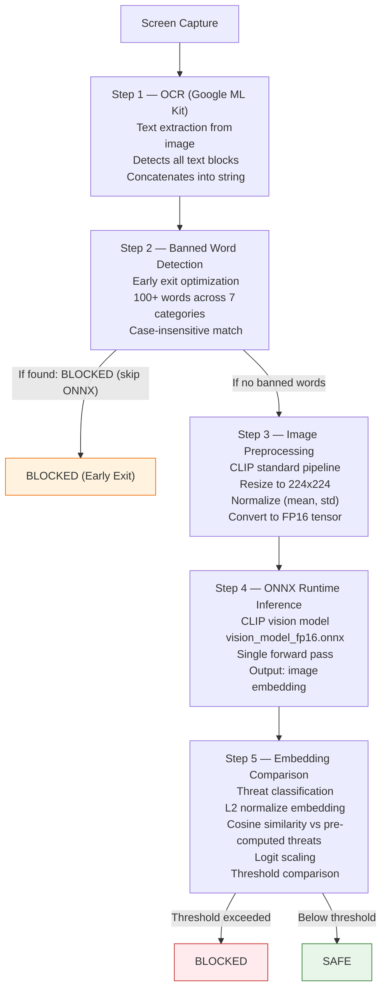
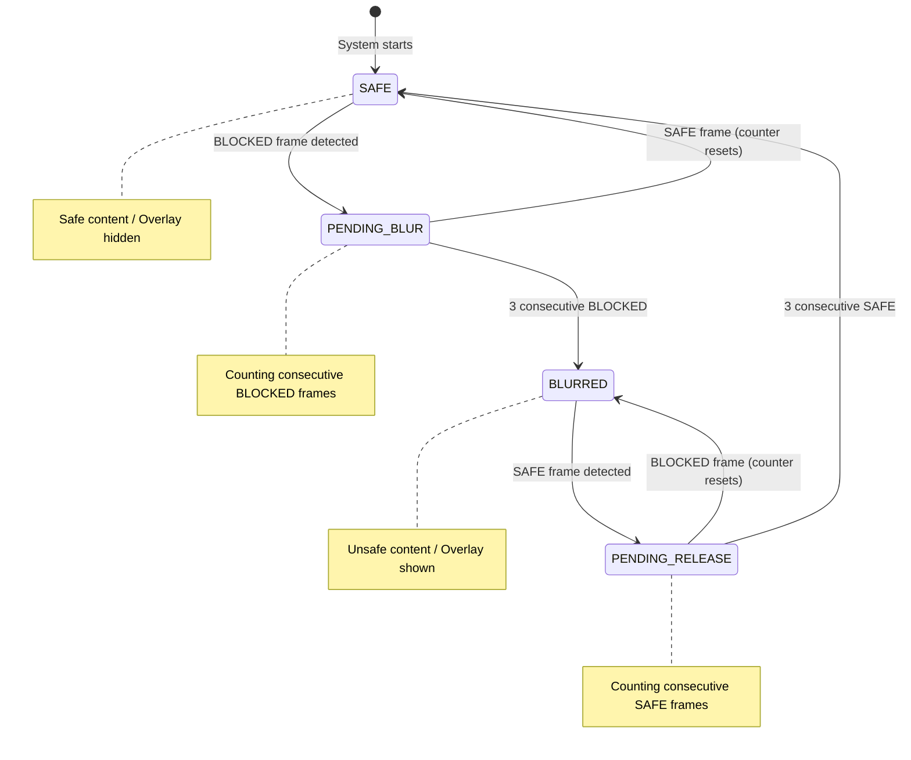
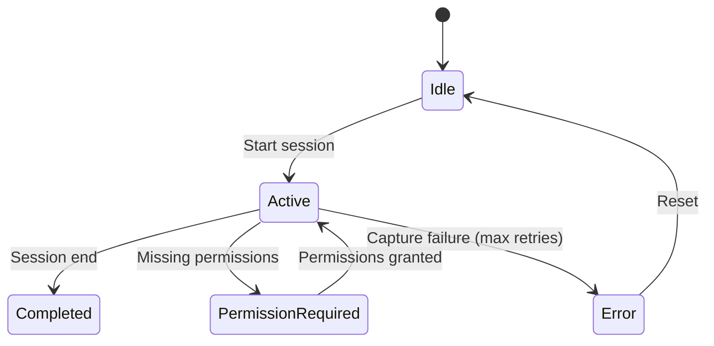
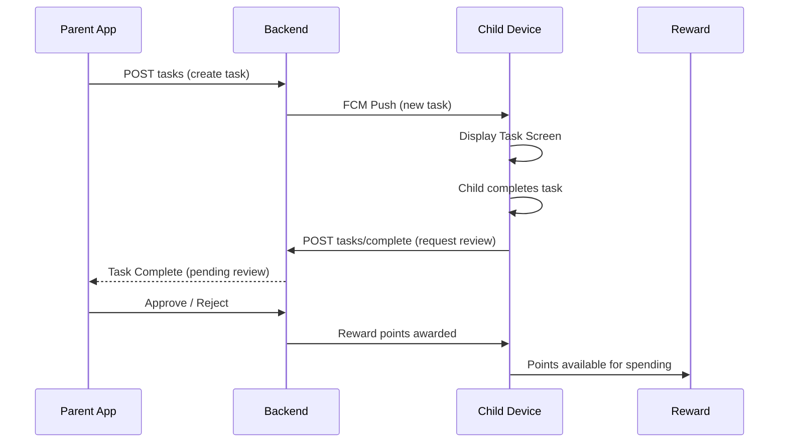
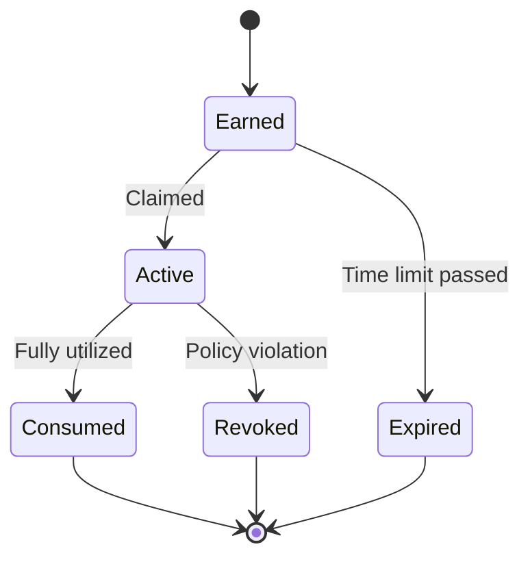
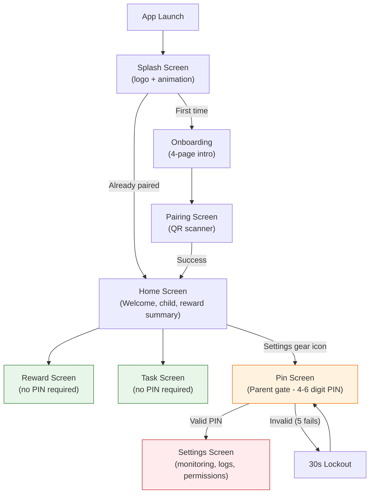
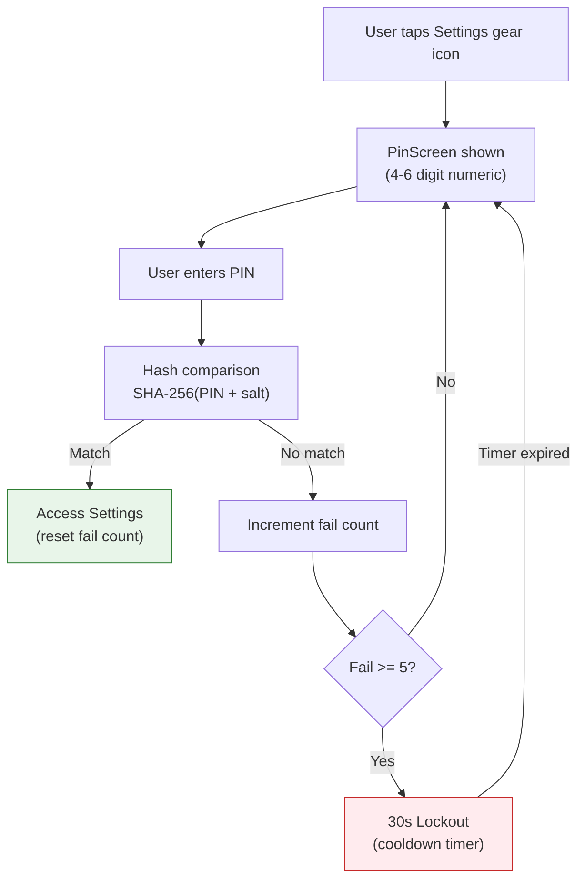

# System Implementation

## 1. Device Monitoring

### 1.1 Location Tracking

The application collects location data using the FusedLocationProviderClient (Google Play Services) with a periodic WorkManager task ensuring hourly uploads. Location data is persisted locally in a Room database (LocationTelemetryEntity) with an isSent flag to support offline operation.

**Location collection flow:**
1. TelemetryManager registers a location request via FusedLocationProviderClient with a minimum interval of 30 minutes and minimum distance threshold of 100 meters.
2. Collected locations are inserted into the Room database with isSent = false.
3. A periodic WorkManager task (LocationTelemetryWorker) runs every hour and:
   - Reads all unsent locations ordered by timestamp.
   - Uploads each location via the backend API (POST locations/telemetry/{childId}).
   - Marks successfully uploaded locations as sent.
   - Deletes sent records to manage database size.
4. Failed uploads are retried with exponential backoff (base 30s, max 60s, up to 5 retries).
5. An FCM-triggered immediate sync can be invoked by sending a silent push notification with sync_locations or trigger_sync data payloads.

### 1.2 Installed Applications Monitoring

The AppsRepository queries the Android PackageManager for all non-system launcher applications on the device. The application list is sent to the backend via POST apps/add-bulk. This enables the parent to view installed apps and configure per-app restrictions.

### 1.3 Session Monitoring

During active AI monitoring sessions, the system tracks device resource metrics:
- **Battery level**: Percentage at session start and end via BatteryManager.
- **Battery charging status**: Whether the device was charging during the session.
- **CPU time**: Extracted from /proc/self/stat.
- **RAM PSS**: Measured via Debug.MemoryInfo at session boundaries.

Per-capture analytics include timestamps, decision outcome, OCR latency, and ONNX inference latency.

## 2. Screen and App Usage Time Management

The system manages device usage time at two levels: overall screen time for the entire device and per-app restrictions configured by the parent.

### 2.1 Application Management

- **Application discovery**: Periodic scanning of installed packages via PackageManager.
- **Categorization**: Applications can be categorized (Education, Games, Social, Productivity) based on package metadata and configurable rules.
- **Application blocking**: Restricted applications can be blocked via system overlay interception and Accessibility Service navigation control.
- **Time limits**: Per-application daily usage limits are enforced at the system level by tracking foreground time via UsageStatsManager and interrupting access when limits are reached.

### 2.2 Screen and App Usage Time

**Overall Screen Time:**
- **Daily limits**: Total device usage is capped at a parent-configured daily limit.
- **Scheduled access**: Specific time windows (e.g., study hours, bedtime) restrict device usage.
- **Temporary restrictions**: Parents can impose immediate short-term restrictions through the parent application.
- **Automatic enforcement**: Limits are enforced locally via Accessibility Service and system overlay mechanisms. No backend connectivity is required for enforcement.
- **Usage recovery**: Children can earn additional screen time through successful task completion, with the earned time immediately applied to the current day's allowance.

**Per-App Restrictions:**
Parents can create individual app restrictions through the parent application for specific applications on the child's device:
- **Blocked apps**: Selected applications can be completely blocked during configured time windows.
- **Time-limited apps**: Specific apps can be assigned individual daily usage limits, independent of the overall device limit.
- **Allow-listed apps**: Certain apps (e.g., educational or communication tools) can be exempted from restrictions.
- **App list synchronization**: The child device sends the installed application list to the backend via `POST apps/add-bulk`, and the parent selects which apps to restrict through the parent application interface.
- **Enforcement**: Blocked apps are detected via the Accessibility Service and prevented from launching or are immediately backgrounded when opened.
- **Live sync**: When the parent modifies app restrictions through the parent application, an FCM push notification is sent to the child device to trigger an immediate sync of the updated policy. The child device fetches the latest restrictions from the backend and applies them without requiring a restart or manual refresh.

### 2.3 Restriction Enforcement

Restrictions are enforced locally through multiple mechanisms:

- **Real-time enforcement**: The foreground monitoring service evaluates each AI analysis result against active policies. BLOCKED content triggers immediate overlay and notification actions.
- **Accessibility Service**: Detects application launches and navigation events, enabling policy-based interception.
- **System overlay blocking**: When an application is restricted, a system overlay prevents interaction with the app.

## 3. Content Protection System

The Content Protection System is the core AI-powered feature of the application. It performs real-time on-device content moderation using a CLIP-based vision model running via ONNX Runtime, combined with Google ML Kit for optical character recognition.

### 3.1 Architecture Overview

The system is composed of five coordinated components:

| Component               | Responsibility                                                                       |
| ----------------------- | ------------------------------------------------------------------------------------ |
| AiAnalyzer              | Core inference engine: ONNX model loading, image preprocessing, embedding comparison |
| SessionManager          | Session lifecycle orchestration, configuration, device stats monitoring              |
| SessionCaptureService   | Foreground service: MediaProjection capture loop, VirtualDisplay management          |
| BlurOverlayManager      | BroadcastReceiver-based show/hide of frosted-glass overlay                           |
| BlurNotificationManager | High-priority notifications for blocked content alerts                               |

These components are wired together via Hilt dependency injection, with the SessionManager acting as the central coordinator.

### 3.2 AI Analysis Pipeline (AiAnalyzer)

The analysis of each captured frame follows a strict sequential pipeline with early-exit optimization:



**OCR and Banned Word Detection**

Google ML Kit Text Recognition scans each frame for text content. The extracted text is checked against a banned word list organized into 7 categories:

| Category | Examples |
|---|---|
| Profanity | Common swear words and obscenities |
| Violence | Words related to fighting, weapons, harm |
| Adult | Sexually explicit or suggestive terms |
| Drugs | Substance-related terminology |
| Weapons | Firearm, knife, explosive references |
| Hate | Discriminatory or derogatory language |
| Gambling | Betting, casino-related terms |

Detection is case-insensitive. If any banned word is found, the pipeline exits early with a BLOCKED decision, avoiding the computationally expensive ONNX inference step entirely.

**Image Preprocessing**

Before ONNX inference, the captured bitmap undergoes CLIP-standard preprocessing:
1. Resize to 224x224 pixels (CLIP vision encoder input size).
2. Normalize using CLIP mean and standard deviation values.
3. Convert to FP16 normalized tensor via buffer allocation and memory mapping.

**ONNX Runtime Inference**

The preprocessed tensor is fed into the CLIP-based vision model:
- **Model**: vision_model_fp16.onnx, a CLIP ViT variant with FP16 quantization.
- **Runtime**: ONNX Runtime Android (OrtSession).
- **Output**: A fixed-dimensional embedding vector representing the image content.
- **Performance**: Approximately 372 ms average inference time on modern Android devices.

**Embedding Comparison and Threat Classification**

The extracted embedding is compared against pre-computed threat embeddings loaded from saved_embeddings.json:
1. L2 Normalization of both image embedding and threat embeddings.
2. Cosine similarity via dot product of normalized vectors.
3. Logit scaling using temperature scaling factor exp(4.60517).
4. Threshold comparison against pre-computed threat embeddings using default thresholds: Adult = 0.35, Violence = 0.40, Other = 0.40.

If any threat score exceeds its threshold, the content is classified as BLOCKED. Otherwise, it is classified as SAFE.

**Performance Instrumentation**

Every phase of the pipeline is instrumented with timing measurements:

| Phase          | Timing Variable  | Typical Duration |
| -------------- | ---------------- | ---------------- |
| OCR            | ocrTimeMs        | ~176 ms          |
| Preprocessing  | preprocessTimeMs | ~97 ms           |
| ONNX Inference | onnxTimeMs       | ~372 ms          |
| Total          |                  | ~645 ms          |

These timings are logged and stored per-capture for analytics and performance monitoring.

### 3.3 Blur Overlay Finite State Machine

The blur overlay is not toggled on every single BLOCKED frame. A finite state machine prevents flickering from transient content:



(ده زى بتاع فتوح اللى بيقول UI Blur stab. logic)
- **SAFE -> PENDING_BLUR**: First BLOCKED frame detected; start counting consecutive violations.
- **PENDING_BLUR -> BLURRED**: Configurable threshold reached (default: 3 consecutive BLOCKED frames); show overlay.
- **BLURRED -> PENDING_RELEASE**: First SAFE frame while blurred.
- **PENDING_RELEASE -> SAFE**: Configurable consecutive SAFE frames (default: 3); hide overlay.
- **PENDING_BLUR/PENDING_RELEASE**: State resets on opposite decision.

Default thresholds:
- blurTriggerThreshold: 3 consecutive unsafe frames.
- blurReleaseThreshold: 3 consecutive safe frames.


*Figure 6.1: Frosted-glass blur overlay activated when unsafe content is detected. The overlay blocks the app content until sufficient safe frames are observed.*

### 3.4 Session Lifecycle

Sessions organize continuous monitoring periods with full lifecycle tracking.

**Session States**



**Session Configuration**

| Parameter | Default | Range |
|---|---|---|
| sessionIntervalMs | 1000 ms | 500-5000 ms |
| blurTriggerThreshold | 3 frames | 1-10 |

**Device Resource Monitoring**

Each session tracks device-level metrics at start and end: battery level via BatteryManager, CPU time from /proc/self/stat, and RAM PSS via Debug.MemoryInfo.

**Capture Loop**

```
while (session is Active) {
    1. Capture frame via MediaProjection + ImageReader
    2. Extract bitmap from ImageReader
    3. Run AiAnalyzer.analyzeImage(bitmap)
    4. Apply blur FSM decision
    5. Store analysis result (batched for SAFE, immediate for BLOCKED)
    6. Wait for configured interval
}
```

**Batched vs Immediate Writes**

To minimize database I/O:
- SAFE results: Batched, written to Room DB every 10 results or every 5 seconds.
- BLOCKED results: Written immediately to ensure no data loss on crash.

**Fault Tolerance**

- Auto-restart: Up to 5 consecutive restart attempts on capture failure.
- Exponential backoff: Increasing delay between restart attempts.
- Max retry cap: After 5 failures, session enters Error state.

### 3.5 Database Schema

**sessions table**

| Column | Type | Description |
|---|---|---|
| id | Long (PK, auto) | Session identifier |
| startTime | Long | Epoch millis of session start |
| endTime | Long (nullable) | Epoch millis of session end |
| status | String | Idle, Active, Completed, Error |
| intervalMs | Long | Capture interval in ms |
| totalCaptures | Int | Total frames processed |
| blockedCount | Int | Number of BLOCKED decisions |
| safeCount | Int | Number of SAFE decisions |
| batteryStart | Int | Battery % at session start |
| batteryEnd | Int (nullable) | Battery % at session end |
| batteryCharging | Boolean | Charging state |
| cpuTimeMs | Long | Total CPU time |
| cpuUsagePercent | Double | CPU usage percentage |
| ramPssMb | Double | RAM PSS in MB |

**analysis_results table**

| Column | Type | Description |
|---|---|---|
| id | Long (PK, auto) | Result identifier |
| sessionId | Long (FK -> sessions) | Parent session |
| timestamp | Long | Capture timestamp |
| analysisResult | String | Safe or Blocked |
| decision | String | BLOCKED or SAFE |
| ocrTimeMs | Long | OCR duration |
| onnxTimeMs | Long | ONNX inference duration |
| threatDetails | String (JSON) | Per-category threat scores |
| imagePath | String (nullable) | Path to captured image file |

### 3.6 Behavior Reporting and Parent Preview

Analysis results from each monitoring session are transmitted to the backend to provide parents with visibility into their child's digital behavior. This enables the parent application to display behavior reports and trends over time.

**Data transmitted per analysis result:**

| Field | Description | Privacy Status |
|---|---|---|
| sessionId | Session identifier | Non-identifying |
| timestamp | Capture timestamp | Required for timeline |
| decision | BLOCKED or SAFE | Behavior indicator |
| analysisResult | Blocked category (if applicable) | Behavior indicator |
| ocrTimeMs | OCR processing time | Performance metric |
| onnxTimeMs | ONNX inference time | Performance metric |
| threatDetails | Per-category threat scores (JSON) | Behavior indicator |

**Voting System for Parent Review**

A subset of captured frames is selected throughout the day and sent to the parent via API for manual review and voting. This allows the parent to validate or override the on-device AI model's decisions, creating a feedback loop that improves local model accuracy over time.

- Selected frames are sampled at a configurable interval during active monitoring sessions.
- Each frame is sent to the backend with the on-device decision (BLOCKED / SAFE) and threat scores.
- The parent reviews the image in the parent application and casts a vote (BLOCKED / SAFE) on each submission.
- Votes are sent back to the child device and used as labeled data for local model refinement.
- Detailed implementation of the voting system, including the local model update pipeline, is described in the ANIS AI Services documentation.

**Not transmitted (unless selected by the voting system):**
- Captured images (stored locally only, used for on-device analysis)
- Extracted OCR text (used only for on-device banned word detection)
- Application-specific content or personal data

**Parent visibility:**

The parent application can view:
- Blocked content events with timestamps and threat categories
- Session summaries (total captures, blocked count, safe count)
- Behavioral trends over time (blocked event frequency, safe browsing duration)
- Device resource metrics during monitoring sessions (battery, CPU, RAM)
- Voting queue with images flagged by the sampling system for manual review

This approach balances the parent's need for behavioral insight with the child's privacy: detailed content analysis stays on-device, while aggregated behavior indicators and a sampled subset of frames are reported for parental oversight.

### 3.7 Export System

Individual session data can be exported for analysis:
- **XLSX export**: Session summary sheet and detailed analysis results sheet.
- **ZIP export**: XLSX file bundled with all captured images from the session.
- **All sessions export**: Aggregated XLSX across all sessions.

Export uses FastExcel for XLSX generation and Android's ZipOutputStream for archive creation.

### 3.8 Protected Content Overlay

When blocked content is detected and the FSM triggers the BLURRED state:
1. Frosted glass overlay: White background with 94% opacity, system overlay using TYPE_APPLICATION_OVERLAY.
2. BroadcastReceiver mechanism: BlurOverlayManager sends and receives broadcasts to show or hide the overlay.
3. High-priority notification: BlurNotificationManager displays a heads-up notification on blocked content with vibration alert.
4. Auto-recovery: After blurReleaseThreshold consecutive safe frames, overlay is dismissed automatically.

### 3.9 Permission Requirements

The content protection system requires three Android runtime permissions:

| Permission | Purpose |
|---|---|
| MediaProjection | Screen capture for analysis |
| SYSTEM_ALERT_WINDOW | Blur overlay display |
| POST_NOTIFICATIONS | Blocked content alerts (Android 13+) |

Permission flow:
1. Application checks if all permissions are granted.
2. If missing, session transitions to PermissionRequired state.
3. User is navigated to Permissions Screen.
4. After granting, session resumes automatically.

## 4. Device Pairing

The device pairing process establishes a secure association between the child device and the parent account. See System Architecture and Design (Section 4.5) for the sequence diagram of the full pairing flow.

1. The parent generates a QR code through the parent application containing a JSON payload with action, childId, and token.
2. The child application uses CameraX with ML Kit Barcode Scanning to scan the QR code.
3. The PairingViewModel parses the QR data and constructs a PairingRequest with the device ID, device name, and FCM token.
4. The AuthRepository sends the pairing request to POST children/pair.
5. On success, the backend returns an access token which is stored in EncryptedSharedPreferences.
6. The child profile (name, age, email, avatar URL) is fetched via GET children/me.
7. The application transitions from the unpaired state to the paired state.


*Figure 4.1: QR code scanning screen during device pairing.*

## 5. Task System

### 5.1 Overview

The Task System provides a structured mechanism for parents to assign activities and responsibilities through the parent application. Children complete tasks to earn reward points, which they can then spend on rewards via the Reward Screen. This creates a positive reinforcement loop that encourages productive behavior and responsibility.

### 5.2 Task Lifecycle



1. **Task creation**: A parent creates a task through the parent application, specifying title, description, due date, and reward point value.
2. **Delivery**: The backend stores the task assignment and sends a push notification to the child device via FCM.
3. **Display**: The child opens the Task Screen to view all assigned tasks with their point values and due dates.
4. **Completion**: The child completes the task and submits a completion request (`POST tasks/complete`) for parent review.
5. **Review**: The parent reviews the submission through the parent application and approves or rejects it.
6. **Reward**: Upon approval, reward points are credited to the child's balance, available for spending on the Reward Screen.

### 5.3 Task Screen

The Task Screen is accessible from the Home Screen without a PIN, ensuring children can freely view and manage their responsibilities. The screen presents:

- Task title and description with clear instructions.
- Reward point value displayed for each task.
- Due date and remaining time indicator.
- Completion status (pending, submitted, approved, rejected).
- Submit button that triggers a completion review request.


*Figure 5.1: Task screen displaying parent-assigned tasks with point values, due dates, and completion status.*

## 6. Reward Management System

### 6.1 Objectives

The Reward Management System reinforces positive behavior and encourages healthy digital habits through a structured incentive framework. The system aims to:

- Create a positive feedback loop linking good digital behavior with tangible rewards.
- Provide parents with a flexible tool for behavior management.
- Give children visibility into the consequences of their digital choices.
- Integrate with the content protection system to reward sustained safe behavior.
- Provide a redemption marketplace where children can spend earned points on rewards of their choice.

### 6.2 Reward Points Economy

The reward system operates on a points-based economy:

- **Earning points**: Children earn reward points primarily by completing parent-assigned tasks. Each task has a point value set by the parent during creation.
- **Bonus points**: Additional points can be earned through sustained safe browsing periods (no content violations) and surprise rewards issued by the parent.
- **Spending points**: Children redeem their accumulated points on the Reward Screen to purchase rewards configured by the parent.
- **Point deductions**: Policy violations or incomplete tasks may result in point deductions at the parent's discretion.

### 6.3 Reward Types

| Reward Type | Description | Parent Configurable |
|---|---|---|
| Additional Screen Time | Extra minutes added to daily allowance | Yes (duration) |
| Temporary Privilege Unlocks | Access to restricted apps for a limited period | Yes (apps, duration) |
| Achievement Badges | Milestone-based recognition for sustained good behavior | Yes (criteria) |
| Custom Rewards | Parent-defined rewards (e.g., "Choose weekend movie") | Yes (description) |

### 6.4 Dynamic Reward Adjustment

Parents can dynamically adjust the reward system through the parent application:

- **Modifications**: Add, remove, or modify reward types and values at any time.
- **Reduction**: Reward values can be reduced for policy violations.
- **Enhancement**: Sustained good behavior can trigger reward value increases.
- **Surprise rewards**: Parents can issue unscheduled rewards for exceptional behavior.

### 6.5 Reward Lifecycle



| State | Description |
|---|---|
| **Earned** | Reward has been earned but not yet activated or claimed |
| **Active** | Reward is currently in effect (e.g., extra time being used) |
| **Consumed** | Reward has been fully utilized |
| **Expired** | Time-limited reward that was not activated before expiration |
| **Revoked** | Reward cancelled due to policy violation |

### 6.6 Integration with Content Protection

The reward system is directly integrated with the content protection system:

- **Positive behavior**: Periods of uninterrupted safe browsing (no blocked content) contribute to reward accumulation.
- **Violations**: Blocked content events can reduce or revoke accumulated rewards based on severity and frequency.
- **Transparency**: The child can see the direct correlation between their browsing behavior and their reward balance through the Reward Screen.
- **Notification**: Both positive reward events and reward reductions trigger notifications on the child's device.

### 6.7 Reward Screen

The Reward Screen is accessible from the Home Screen without a PIN, allowing children to freely monitor their progress and spend earned points. The screen displays:

- Current reward point balance and equivalent value.
- Available rewards catalog showing each reward's point cost (configured by the parent).
- Purchase button to redeem points for a selected reward.
- Reward history with timestamps and descriptions.
- Pending rewards awaiting parent approval.
- Expired or revoked rewards with explanations.
- Behavior score or progress indicator toward next reward milestone.


*Figure 6.1: Reward overview screen showing balance, history, and pending approvals.*

## 7. Android Components

### 7.1 Activities

**MainActivity** is the single activity that hosts the entire Compose UI. It extends ComponentActivity and acts as the entry point for all user interactions.

Responsibilities:
- Manages runtime permission requests (Camera, Location, MediaProjection, Overlay, Notifications).
- Creates and initializes the PreferenceManager, TelemetryManager, and LogManager.
- Hosts the Compose content tree.
- Controls top-level navigation between the unpaired state (PairingScreen) and paired state (HomeScreen with access to Settings, Reward, and Task screens) using a boolean isLoggedIn state variable.
- Handles the MediaProjection permission result via onActivityResult.

### 7.2 Jetpack Compose Screens

| Screen               | Purpose                                                                                                  | PIN Required      |
| -------------------- | -------------------------------------------------------------------------------------------------------- | ----------------- |
| PairingScreen        | QR code scanning via CameraX and ML Kit Barcode Scanning for device pairing                              | No                |
| HomeScreen           | Welcome screen displaying child name, monitoring status, reward summary, and navigation to other screens | No                |
| PinScreen            | Numeric PIN entry for parent gate to unlock Settings in offline mode                                     | N/A (gate itself) |
| SettingsScreen       | Monitoring toggle, dark mode, permission status, LogSection viewer, device info, logout                  | Yes               |
| TaskScreen           | Task list and completion tracking                                                                        | No                |
| RewardScreen         | Reward balance display, reward history, behavior progress                                                | No                |
| BlockedContentScreen | Notification and details of blocked content events                                                       | No                |


*Figure 7.1: Home screen showing child greeting, monitoring status, recent activity summary, and navigation tiles.*


*Figure 7.2: Settings screen with monitoring toggle, permission indicators, and parent gate (PIN-protected).*

### 7.3 ViewModels

| ViewModel | Key State (StateFlow) | Key Actions |
|---|---|---|
| PairingViewModel | PairingUiState (Scanning, Loading, Success, Error) | parseQrData(), pairDevice() |
| HomeViewModel | Loading states for location, apps, profile | sendCurrentLocation(), sendInstalledApps(), fetchChildMe() |
| PinViewModel | PinUiState (entry, validation, lockout) | validatePin(), setPin(), clearAttempts() |
| SettingsViewModel | MonitoringEnabled, DarkMode, PermissionStates | toggleMonitoring(), toggleDarkMode(), checkPermissions() |
| TaskViewModel | TaskList, completion status | fetchTasks(), completeTask() |
| RewardViewModel | RewardBalance, RewardHistory | claimReward(), fetchHistory() |

### 7.4 Foreground Services

**MonitoringService** (Capture Service):
- Runs as a foreground service with a persistent notification.
- Manages the MediaProjection session and VirtualDisplay creation.
- Implements the capture loop with configurable interval (500-5000 ms).
- Coordinates with AiAnalyzer for per-frame content analysis.
- Handles the blur overlay FSM transitions.
- Implements auto-restart with exponential backoff on failure.

**LocationService**:
- Manages periodic location collection via FusedLocationProviderClient.
- Stores collected locations to Room database for batched upload.

### 7.5 Accessibility Service

The Accessibility Service (android.accessibilityservice.AccessibilityService) provides system-wide monitoring capabilities:

- **App usage tracking**: Detects the current foreground application and tracks time spent per application.
- **Navigation interception**: Intercepts system navigation events for restriction enforcement.
- **App launch detection**: Triggers policy evaluation when a new application is opened.
- **Persistent background operation**: The service continues running even when the application UI is not visible.
- **Configuration**: Declared in AndroidManifest.xml with BIND_ACCESSIBILITY_SERVICE permission and configured via accessibility-service.xml for event types and package tracking.

### 7.6 MediaProjection Service

The MediaProjection Service captures screen content for AI analysis:

- Uses MediaProjectionManager to create a MediaProjection session.
- Creates a VirtualDisplay with an ImageReader surface (PixelFormat.RGBA_8888).
- The ImageReader acquires frames at the configured capture interval.
- Captured Image objects are converted to Bitmaps for analysis.
- The service is started via an Intent obtained from createScreenCaptureIntent() with result handling in MainActivity.

### 7.7 Broadcast Receivers

| Receiver | Purpose |
|---|---|
| BootReceiver | Restarts monitoring and location services after device reboot |
| ConnectivityReceiver | Triggers pending data synchronization when network becomes available |
| ScreenStateReceiver | Pauses monitoring when screen is off, resumes when screen is on |
| BlurOverlayReceiver | Internal communication between BlurOverlayManager and UI for show/hide overlay signals |

### 7.8 WorkManager Tasks

| Worker | Schedule | Purpose |
|---|---|---|
| LocationTelemetryWorker | Periodic (every 1 hour) | Uploads unsent location data with exponential backoff retry |
| LocationImmediateSync | One-shot (FCM triggered) | Immediate location upload on push notification |
| AppsSyncWorker | Periodic (daily) | Reports installed applications list |
| PolicySyncWorker | Periodic + FCM triggered | Fetches latest restriction policies from backend |
| RewardSyncWorker | Periodic + event driven | Synchronizes reward state |

Workers use the following constraints:
- NetworkType.CONNECTED (do not run without internet).
- Exponential backoff with base 30 seconds, max 60 seconds, up to 5 retries.

### 7.9 Notifications

| Notification Channel | Importance | Purpose |
|---|---|---|
| Monitoring Service | Low (priority) | Persistent foreground service indicator |
| Blocked Content | High | Heads-up alert with vibration for blocked content |
| Task Assigned | Default | New task assignment notification |
| Reward Earned | Default | Positive behavior reward notification |
| Reward Expiring | Default | Time-limited reward about to expire |
| Monitoring Status | Low | Status updates and information |

The notification system covers multiple event types:
- **Blocked content alerts**: High-priority notification with vibration when inappropriate content is detected.
- **Parent instructions**: FCM push notifications deliver real-time instructions from parents.
- **Task notifications**: Alerts when new tasks are assigned by the parent.
- **Reward notifications**: Notifications when rewards are earned, claimed, or expiring.
- **Policy sync notifications**: Alerts when app restrictions or limits are updated remotely.
- **Monitoring status**: Persistent foreground service notification indicating that monitoring is active.

### 7.10 Local Storage Components

| Storage | Technology | Data Stored |
|---|---|---|
| Room Database (anis_database) | SQLite + Room | Location telemetry, sessions, analysis results, rewards, tasks |
| EncryptedSharedPreferences | AES-256-GCM | Authentication token, FCM token, child profile, PIN hash |
| DataStore (Preferences) | Jetpack DataStore | Theme preference, monitoring toggle state, session configuration |
| Internal Storage | App-specific filesystem | Captured analysis images, export archives |

Room Database Entities:

- LocationTelemetryEntity: id, latitude, longitude, timestamp, isSent
- SessionEntity: id, startTime, endTime, status, intervalMs, totalCaptures, blockedCount, safeCount, battery metrics, CPU metrics, RAM metrics
- AnalysisResultEntity: id, sessionId (FK), timestamp, analysisResult, decision, ocrTimeMs, onnxTimeMs, threatDetails (JSON), imagePath
- RewardEntity: id, type, value, state (earned/active/consumed/expired/revoked), earnedAt, expiresAt
- TaskEntity: id, title, description, dueDate, completedAt, rewardValue

### 7.11 UI/UX Design

#### Screen Navigation Flow



#### Design Principles

- **Material 3 Design**: Full Material You theming with dynamic color support on Android 12+.
- **Dark/Light Mode**: System-aware with manual toggle in Settings. Custom color palettes for both modes.
- **Single Activity Architecture**: One MainActivity hosts all Compose screens; navigation controlled by sealed class state.
- **Permission-Centric Flow**: Application guides user through permission grants (Camera, Location, MediaProjection, Overlay, Notifications) before enabling core features.
- **Monitoring Status Indicator**: Persistent notification and Settings toggle show current monitoring state.
- **Accessibility**: Content descriptions on all UI elements; large touch targets; high-contrast mode support.
- **Offline-Aware UI**: UI elements gracefully handle offline states with appropriate messaging and disabled states for backend-dependent actions.

## 8. Communication and Synchronization

### 8.1 Backend Communication

The application communicates with the ANIS backend through a RESTful API over HTTPS. Communication is handled by Retrofit 2.9.0 with OkHttp 4.12.0 and kotlinx.serialization.

**Network Stack Architecture:**

```
+------------------+
|   ApiService      |  Retrofit interface (endpoint definitions)
+--------+---------+
         |
+--------+---------+
|   NetworkProvider |  Singleton: OkHttpClient + Retrofit builder
+--------+---------+
         |
+--------+---------+
|   OkHttpClient    |  Interceptors: AuthInterceptor,
|                   |  AppLoggingInterceptor, HttpLoggingInterceptor
+--------+---------+
         |
+--------+---------+
|   TLS 1.3         |  Certificate pinning (optional)
+------------------+
```

**Base Configuration:**

| Parameter | Value |
|---|---|
| Base URL | https://api.anis.solutions/api/v1/ |
| Connect Timeout | 30 seconds |
| Read Timeout | 30 seconds |
| Write Timeout | 30 seconds |
| Content Type | application/json |
| Serialization | kotlinx.serialization JSON |

**Interceptors:**

- **AuthInterceptor**: Reads the access token from EncryptedSharedPreferences and injects an Authorization: Bearer <token> header into every request. If no token is present, the request proceeds without authentication.
- **AppLoggingInterceptor**: Logs every HTTP request (method, path, body) and response (status code, elapsed time, body) via LogManager for in-app debugging.
- **HttpLoggingInterceptor** (OkHttp): Debug-level logging for development builds.

### 8.2 Behavior Data Synchronization

Analysis results from content monitoring sessions are transmitted to the backend for parent preview. The synchronization strategy distinguishes between safe and blocked events:

- **BLOCKED results**: Transmitted immediately via API call when connectivity is available, ensuring parents receive real-time alerts about policy violations.
- **SAFE results**: Batched locally and transmitted periodically (every 10 results or every 5 seconds), reducing network overhead while maintaining parent visibility into browsing patterns.
- **Session summaries**: At session completion, aggregated data (total captures, blocked count, safe count, device metrics, session duration) is uploaded to provide a complete behavior picture.
- **Offline handling**: All results are persisted locally with transmission status tracking. When connectivity is restored, pending results are uploaded in priority order (BLOCKED first, then SAFE batches, then session summaries).

### 8.3 Real-Time Synchronization

Firebase Cloud Messaging provides real-time push notification capabilities:

- **FCM Token Registration**: On first launch and on token refresh (onNewToken), the application registers its FCM token with the backend via POST children/fcm-token.
- **Silent Push Notifications**: The backend can send data-only push messages to trigger immediate actions without user-visible notifications:
  - sync_locations: Triggers immediate location telemetry upload.
  - trigger_sync: Triggers full data synchronization.
  - sync_behavior: Triggers immediate upload of pending analysis results.
- **Policy Updates**: Policy changes made by the parent are propagated to the child device via push notification, triggering PolicySyncWorker for immediate enforcement.
- **Reward Updates**: Reward changes and assignment notifications are delivered via push.

### 8.4 API Endpoints

| Method | Endpoint | Purpose |
|---|---|---|
| POST | children/pair | Device pairing with QR authentication |
| POST | children/fcm-token | FCM token registration and update |
| GET | children/me | Fetch child profile data |
| POST | locations/telemetry/{childId} | Upload location data |
| POST | apps/add-bulk | Report installed applications |
| POST | sessions | Upload session summary (captures, blocked/safe counts, device metrics) |
| POST | sessions/{sessionId}/results | Upload individual analysis results (decisions, threat scores, timestamps, performance) |
| GET | sessions/{sessionId}/results | Fetch analysis results for parent preview |
| GET | sessions | Fetch session history for behavior reports |
| GET | policies | Fetch active restriction policies |
| POST | rewards/claim | Claim earned reward |
| GET | rewards/balance | Fetch current reward state |
| POST | tasks/complete | Mark task as completed |
| GET | tasks | Fetch assigned tasks |

### 8.4 Offline Operation

The application is designed to function reliably without persistent network connectivity:

- **Local policy enforcement**: Restriction policies are cached locally and enforced even when the backend is unreachable. Policy validity is time-stamped so stale policies can be flagged.
- **Offline data queue**: Location telemetry, installed apps data, and analysis results are stored locally with an isSent flag. A WorkManager task processes the queue when connectivity is restored.
- **Exponential backoff**: Failed API operations retry with exponential backoff (base 30 seconds, max 60 seconds, 5 retries maximum) to avoid hammering the backend during connectivity issues.
- **Synchronization recovery**: On connectivity restore (detected via ConnectivityReceiver), all pending operations are processed in priority order: policy sync first (to ensure correct enforcement), then telemetry and app data, then rewards.
- **Cached authentication**: The access token is stored securely in EncryptedSharedPreferences, allowing the application to authenticate immediately when connectivity is restored without re-pairing.

## 9. Dependency Injection with Hilt

### 9.1 DI Architecture

The application uses Hilt (2.51.1) for compile-time dependency injection. Hilt provides a standardized way to manage dependencies across the application's component hierarchy:

- **Application Component** (@HiltAndroidApp): Singleton-scoped, created once for the application lifetime. Hosts core dependencies that must be shared across all components.
- **Activity Component** (@AndroidEntryPoint): Activity-scoped, created and destroyed with MainActivity. Provides activity-level dependencies and ViewModels.
- **Service Component**: Service-scoped, created and destroyed with foreground services. Provides service-level dependencies.
- **ViewModelComponent**: Automatically scoped to each ViewModel's lifecycle via @HiltViewModel.

### 9.2 Provided Dependencies

| Dependency | Scope | Module |
|---|---|---|
| Room Database | Singleton | AppModule |
| SessionDao | Singleton | AppModule |
| AnalysisResultDao | Singleton | AppModule |
| LocationTelemetryDao | Singleton | AppModule |
| Retrofit + OkHttpClient | Singleton | AppModule |
| ApiService | Singleton | AppModule |
| EncryptedSharedPreferences | Singleton | AppModule |
| AiAnalyzer (ONNX Runtime) | Singleton | AiModule |
| SessionManager | Singleton | AiModule |
| PreferenceManager | Singleton | AppModule |
| LogManager | Singleton | AppModule |
| AuthRepository | Singleton | AppModule |
| LocationRepository | Singleton | AppModule |
| FCMRepository | Singleton | AppModule |
| AppsRepository | Singleton | AppModule |
| RewardRepository | Singleton | AppModule |
| PolicyRepository | Singleton | AppModule |

### 9.3 Module Organization

**AppModule** (@Module @InstallIn(SingletonComponent::class)):

Provides application-wide singletons:
- Room database instance and all DAOs.
- OkHttpClient with configured interceptors.
- Retrofit instance with kotlinx.serialization converter.
- EncryptedSharedPreferences instance.
- PreferenceManager and LogManager.
- All repository implementations.

**AiModule** (@Module @InstallIn(SingletonComponent::class)):

Provides AI-related dependencies that are computationally expensive to create:
- AiAnalyzer: Loads the ONNX model and embeddings from assets. Created lazily with @LazySingleton to defer model loading until first analysis request.
- SessionManager: Coordinates session lifecycle. Singleton to maintain session state across service restarts.

**ServiceModule** (@Module @InstallIn(ServiceComponent::class)):

Provides service-scoped dependencies for foreground services:
- MediaProjection instance.
- VirtualDisplay configuration.
- Capture loop dependencies.

**ViewModelModule** (@Module @InstallIn(ViewModelComponent::class)):

Provides ViewModel-scoped dependencies:
- ViewModel instances via @HiltViewModel annotation.
- Automatic disposal of coroutine scopes on ViewModel clear.

### 9.4 Benefits of Hilt in This Application

- **Lifecycle-safe service injection**: Foreground services receive their dependencies through Hilt's service component, ensuring proper cleanup when the service is destroyed.
- **Singleton AI model**: The AiAnalyzer loads the ONNX model once and shares it across all sessions, avoiding repeated 100+ MB model loads.
- **Testability**: Dependencies can be replaced with mocks in tests through Hilt testing support.
- **Compile-time safety**: Dependency graph validation happens at compile time, preventing runtime injection failures.
- **Consistent scoping**: Repository instances are singletons, ensuring consistent data access across ViewModels and services.

## 10. Security and Reliability

### 10.1 Authentication

The application uses JWT (JSON Web Token)-based authentication for all backend communication:

- **Token acquisition**: A token is obtained during the device pairing process (POST children/pair) and stored in EncryptedSharedPreferences.
- **Token storage**: The access token is encrypted using AES-256-GCM via the Android Security Crypto library before being written to SharedPreferences. The encryption key is stored in the Android KeyStore, which provides hardware-backed security on supported devices.
- **Token injection**: Every API request includes the token via the AuthInterceptor, which reads the token from EncryptedSharedPreferences and adds an Authorization: Bearer <token> header.
- **Token lifecycle**: Tokens are validated on each API call. If the backend returns a 401 Unauthorized status, the SafeApiCall wrapper returns an error state, and the application can trigger re-authentication if needed.

### 10.2 Secure Communication

- **TLS encryption**: All API communication occurs over HTTPS with TLS 1.3, ensuring data-in-transit protection.
- **Certificate pinning** (optional): OkHttp can be configured with CertificatePinner to restrict trusted certificates to specific pins, providing additional protection against man-in-the-middle attacks.
- **API request validation**: The backend validates all requests for structural integrity and authorization before processing.

### 10.3 Secure Local Storage

| Data | Storage Mechanism | Encryption |
|---|---|---|
| Access token | EncryptedSharedPreferences | AES-256-GCM |
| FCM token | EncryptedSharedPreferences | AES-256-GCM |
| Child profile | EncryptedSharedPreferences | AES-256-GCM |
| PIN hash | EncryptedSharedPreferences (SHA-256 + salt hash) | Not reversibly encrypted |
| User preferences | DataStore | Not encrypted (non-sensitive) |
| Location data | Room database | Database-level (optional) |
| Analysis results | Room database | Database-level (optional) |
| Captured images | Internal storage | App-specific directory (not accessible to other apps) |

### 10.4 Offline PIN Protection

To prevent unauthorized access to application settings when the device is offline and parent authentication via the backend is unavailable, a local PIN system gates access to the Settings screen.

**PIN Creation and Storage:**

- The PIN is set during initial device setup after QR pairing.
- The PIN hash (SHA-256 with a random salt) is stored in EncryptedSharedPreferences.
- The salt is generated using SecureRandom and stored alongside the hash.
- The raw PIN is never stored. Only the hash is persisted.

**PIN Entry Flow:**



**Attempt Tracking:**

- Failed attempts are tracked in EncryptedSharedPreferences (failedAttempts counter).
- After 5 consecutive failures, a 30-second cooldown is enforced (lockoutUntil timestamp).
- On successful PIN entry, the failedAttempts counter is reset to zero.
- The lockout time is validated on the client side; the Settings screen remains inaccessible until the cooldown expires.

**PIN Recovery:**

If the parent forgets the PIN, recovery requires re-pairing:
1. The parent generates a new QR code through the parent application.
2. The child scans the QR code, which includes an optional PIN reset flag.
3. The PIN hash in EncryptedSharedPreferences is cleared.
4. A new PIN is set during the re-pairing flow.

**Screens Not Protected by PIN:**

- Task Screen: Accessible freely so the child can track responsibilities.
- Reward Screen: Accessible freely so the child can view progress and motivation.

**Screens Protected by PIN:**

- Settings Screen: Changing monitoring preferences, viewing logs, adjusting permissions, toggling monitoring state.

**Implementation:**

- PinManager: Singleton managing PIN hash generation, verification, and attempt tracking.
- PinScreen: Compose screen with numeric keypad, visual feedback, error state, and lockout timer.
- PinViewModel: Manages PIN entry state, validation logic, and lockout state with StateFlow.
- EncryptedSharedPreferences: Stores pinHash, pinSalt, failedAttempts, lockoutUntil.

### 10.5 Tamper Resistance

- **Service auto-restart** : Foreground services restart automatically if killed by the system, with up to 5 consecutive restart attempts and exponential backoff.
- **Boot persistence**: The BootReceiver restarts monitoring and location services when the device reboots, ensuring continuous protection.
- **Permission verification**: On every service start, all required permissions are re-verified. If permissions have been revoked, the service enters a PermissionRequired state and notifies the user.
- **Integrity checks**: The application performs periodic validation of its core components. If the Accessibility Service is disabled or the monitoring service is not running, the user is notified and prompted to re-enable.

### 10.6 Reliability Measures

| Measure | Implementation |
|---|---|
| Crash recovery | Automatic service restart with exponential backoff (max 5 attempts) |
| Network retry | Exponential backoff (30s base, 60s max, 5 retries) |
| Database performance | Batched writes for SAFE results (10 items or 5 seconds) |
| Capture fault tolerance | Consecutive failure threshold with max retry cap, service auto-restart |
| Background persistence | High-priority foreground notification keeps process alive |
| Offline data queue | Unsent data persisted locally with automatic sync on connectivity restore |
| ANR prevention | All network and AI operations on background coroutines |

### 10.7 Error Handling and Logging

#### API Error Handling

All API calls are wrapped in a SafeApiCall inline function that returns a sealed ApiResult type:

```kotlin
sealed class ApiResult<out T> {
    data class Success<T>(val data: T) : ApiResult<T>()
    data class Error(
        val message: String,
        val code: Int? = null,
        val details: String? = null
    ) : ApiResult<Nothing>()
}
```

The wrapper catches three exception types:
- HttpException: Server errors (4xx/5xx) with status code extraction.
- IOException: Network failures (timeout, DNS, connectivity loss).
- Generic Exception: Unexpected errors with message capture.

#### HTTP Logging Interceptor

A custom AppLoggingInterceptor logs every API request and response including HTTP method, URL path, request body, response status code, elapsed time in milliseconds, and response body. All logs are routed through LogManager for in-app viewing.

#### Retry and Backoff

Failed API operations implement exponential backoff with base delay of 30 seconds, maximum delay of 60 seconds, and maximum of 5 retries. This applies to location telemetry upload, FCM token registration, and apps synchronization.

#### In-App Logging (LogManager)

LogManager provides 5 log types stored in SharedPreferences with a capacity of up to 100 entries:

| Log Type | Color | Use Case |
|---|---|---|
| INFO | White | General events |
| SUCCESS | Green | Successful API calls and operations |
| ERROR | Red | Failures and exceptions |
| LOCATION | Blue | GPS acquisition and telemetry |
| HTTP | Yellow | Request and response details |

Logs are viewable in the Settings screen's collapsible LogSection with monospace formatting and color-coded rows.

#### Crash Recovery

- Foreground services auto-restart on crash with up to 5 consecutive attempts.
- Exponential backoff between restart attempts.
- BootReceiver restarts services after device reboot.
- Permission re-verification on every service start.

### 10.8 Anti-Uninstall and Anti-Disable

The application employs multiple layers to prevent the child from uninstalling or disabling the app, ensuring continuous protection cannot be bypassed.

#### Device Admin Enrollment

The app registers as a Device Admin via `DeviceAdminReceiver`:

```kotlin
class SecurityAdminReceiver : DeviceAdminReceiver() {
    override fun onEnabled(context: Context, intent: Intent) {
        LogManager.log("Device admin granted", LogType.INFO)
    }

    override fun onDisabled(context: Context, intent: Intent) {
        LogManager.log("Device admin revoked — alerting parent", LogType.ERROR)
        FcmNotificationSender.sendAdminDisabledAlert(context)
    }
}
```

Enrollment is requested after QR pairing completes. While Device Admin is active:
- The standard Android uninstall flow is blocked — the user must first deactivate the admin in Security settings.
- Deactivating admin triggers `onDisabled`, which sends an immediate FCM alert to the parent.
- The parent is notified that the child has attempted to disable protection.

#### Accessibility Service Uninstall Interception

The Accessibility Service monitors for navigation to package management screens:
- Detects when the system Settings App Info page is opened for this application's package name.
- Intercepts the `TYPE_WINDOW_STATE_CHANGED` event for package installer and settings packages.
- Displays a PIN-gated blocking overlay preventing access to the uninstall or force-stop button.
- If Accessibility Service is revoked, an FCM notification is sent to the parent.

#### Screen Pinning

For younger children, the app supports optional screen pinning:
- The parent enables pinning through the parent application.
- The child device calls `startLockTask()` to pin the current task.
- Exiting the pinned state requires a PIN (set during pairing).
- If unpinning is attempted without the PIN, a notification is sent to the parent.

#### Integrity Monitoring

A periodic WorkManager task monitors critical components:

| Component | Check | Action on Failure |
|---|---|---|
| Foreground Service | `isServiceRunning()` | Auto-restart with exponential backoff |
| Accessibility Service | `isAccessibilityEnabled()` | Request re-enable via system prompt |
| Device Admin | `isAdminActive()` | Notify parent via FCM |
| Screen Pinning | `isLockTaskActive()` (if enabled) | Re-pin with PIN challenge |

Checks run every 15 minutes. On repeated failures (3+ consecutive), an immediate FCM alert is escalated to the parent.
